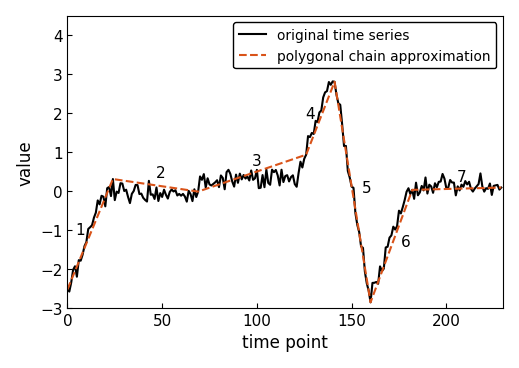
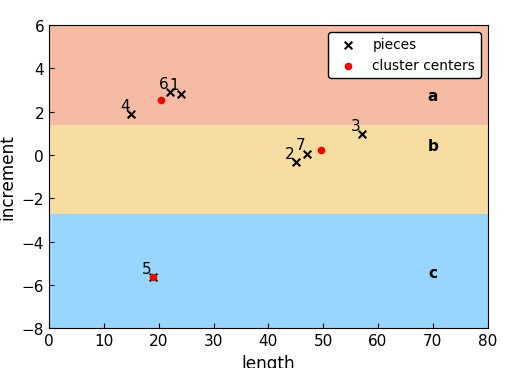

[](https://travis-ci.com/nla-group/ABBA)
[](https://codecov.io/gh/nla-group/ABBA)
[](https://opensource.org/licenses/MIT)

# ABBA
This repository provides ABBA, an algorithm for the adaptive symbolic
aggregation of time series. The ABBA algorithm consists of two
key parts: compression via an adaptive piecewise linear approximation, and
digitization via mean-based clustering on the increments and lengths of each
piece.

The algorithm uses a scaling parameter `scl` to control the weighting of
the increments and lengths during the clustering.
If `scl = 0` or `scl = np.inf`, a one-dimensional clustering algorithm can be
used. We use a modified C++ implementation of CKmeans from Ckmeans.1d.dp R
package; see Prerequisites. If the C++ implementation is not available or a
different scaling parameter is used, then ABBA uses the Kmeans algorithm
from the Python package Scikit-learn.

As an example, we consider a synthetic time series and apply ABBA's compression
method, which approximates the time series by a sequence of linear segments
stitched together. Each segment can be represented by its change in the
x-value (`len`) and change in y-direction (`inc`).



ABBA's digitization procedure clusters the tuples `(len, inc)`,
assigning a unique symbol to each cluster.



The symbolic representation of the time series is 'abbacab'. For further
information on ABBA, see [1].

### Prerequisites
Install python packages:
```
pip install -r requirements.txt
```

If `scl = 0` or `scl = np.inf`, then ABBA will attempt to use a C++ implementation
of the CKmeans algorithm. For this we use SWIG, an open source Simplified
Wrapper and Interface Generator. SWIG generated a shared library and
corresponding python file which provides a wrapper for the C++ function. SWIG
can be installed via the following commands:

Linux (Ubuntu):
```
sudo apt-get install swig
```

Mac:
```
brew install swig
```

Once installed, the Python wrapper can be constructed using the makefile.
```
make
```

## Testing
Run the unit tests by the following command:
```
python test_ABBA.py -v
```

## Example

```python
>>> from ABBA import ABBA
>>> ts = [-1, 0.1, 1.3, 2, 1.9, 2.4, 1.8, 0.8, -0.5]
>>> abba = ABBA()
>>> string, centers = abba.transform(ts)
Compression rate:  77.77777777777779
Digitization: Using 4 symbols
>>> reconstructed_ts = abba.inverse_transform(string, centers, ts[0])
>>> print([round(i, 1) for i in reconstructed_ts])
[-1, 0.1, 1.3, 1.9, 1.5, 2.1, 1.8, 0.6, -0.5]
```

## TODO

* Make patches produce reconstruction that is the same length as original time series.
* Isolate clustering from digitization. This will allow us to convert time series using already constructed ABBA representation.


## License

This project is licensed under the MIT License - see the [LICENSE.md](LICENSE.md)
file for details


## Acknowledgments

* All contributors to Ckmeans.1d.dp R package
(https://cran.r-project.org/web/packages/Ckmeans.1d.dp/index.html)
* All contributors to the UCR Time Series Classification Archive
(https://www.cs.ucr.edu/~eamonn/time_series_data_2018/)
* Timothy D. Butters for help with C++ and SWIG
* Massimiliano Fasi for the performance profiling code


## References

[1] S. Elsworth and S. Güttel. ABBA: Adaptive Brownian bridge-based symbolic
aggregation of time series, MIMS Eprint 2019.11 (<http://eprints.maths.manchester.ac.uk/2712/>),
Manchester Institute for Mathematical Sciences, The University of Manchester, UK, 2019.
