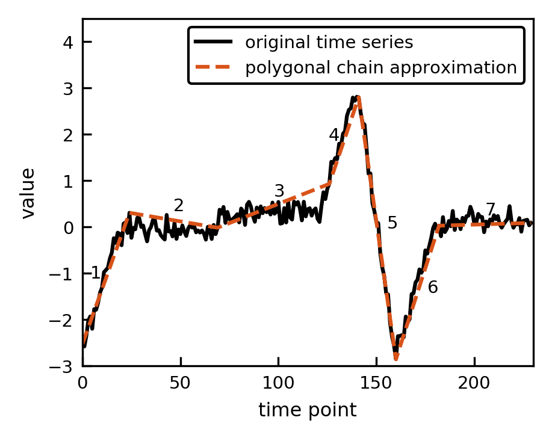
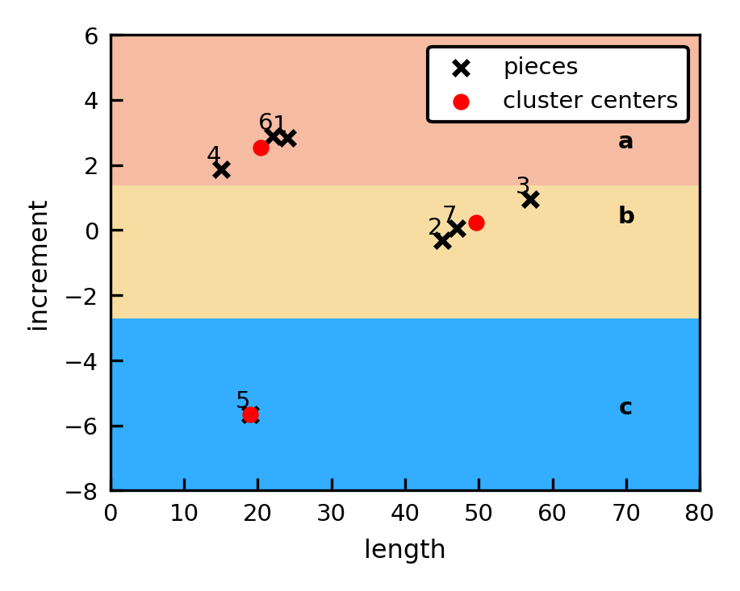

# ABBA
This repository contains ABBA: A symbolic time series representation building
Brownian bridges. The ABBA symbolic representation consists of two key parts:
compression via a piecewise adaptive linear approximation and digitization via
clustering on the increment and lengthe of each piece/segment. The algorithm
uses a scaling parameter scl to control the weighting of the increments and
lengths during the clustering.

If scl = 0 or scl = np.inf, then a one dimensional clustering algorithm can be
used. We use a modified C++ implementation of CKmeans from Ckmeans.1d.dp R
package, see Prerequisites. If the C++ implementation is not available or a
different scaling parameter value is used then ABBA uses Kmeans from the python
package Scikit-learn.

Consider a synthetic time series, applying ABBA's compression approximates the
time series by a sequence of linear segments stitched together. Each segment can
be represented by the change in x-direction (len) and change in y-direction (inc).



Applying ABBAs digitization procedure clusters the tuples (len, inc) and pairs
each cluster with a unique symbol.



The symbolic representation of the time series is now 'abbacab'. For further
information on ABBA, see [1].

### Prerequisites

If scl = 0 or scl = np.inf, then ABBA will attempt to use a C++ implementation
of the CKmeans algorithm. For this we use SWIG, an open source Simplified
Wrapper and Interface Generator. SWIG generated a shared library and
corresponding python file which provides a wrapper for the C++ function. SWIG
can be installed via the following commands:

Linux (Ubuntu):
```
sudo apt-get install swig
```

Mac:
```
brew install swig
```

Once installed, the python wrapper can be constructed using the makefile.
```
make
```


## Example

```python
>>> from ABBA import ABBA
>>> ts = [-1, 0.1, 1.3, 2, 1.9, 2.4, 1.8, 0.8, -0.5]
>>> abba = ABBA()
>>> string, centers = abba.transform(ts)
Compression rate:  77.77777777777779
Digitization: Using 4 symbols
>>> reconstructed_ts = abba.inverse_transform(string, centers, ts[0])
>>> print([round(i, 1) for i in reconstructed_ts])
[-1, 0.1, 1.3, 1.9, 1.5, 2.1, 1.8, 0.6, -0.5]
```


## License

This project is licensed under the MIT License - see the [LICENSE.md](LICENSE.md)
file for details


## Acknowledgments

* All contributors to Ckmeans.1d.dp R package
(https://cran.r-project.org/web/packages/Ckmeans.1d.dp/index.html)
* All contributors to the UCR Time Series Classification Archive
(https://www.cs.ucr.edu/~eamonn/time_series_data_2018/)
* Dr Timothy D. Butters for help with C++ and SWIG
* Massimiliano Fasi for performance profiling code


## References

[1] S. Elsworth and S. Güttel. ABBA: A symbolic time series representation
building Brownian bridges, MIMS Eprint 2019.$ (<url>), Manchester Institute for
Mathematical Sciences, The University of Manchester, UK, 2019.
